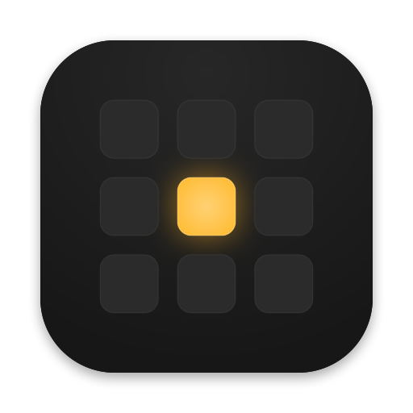
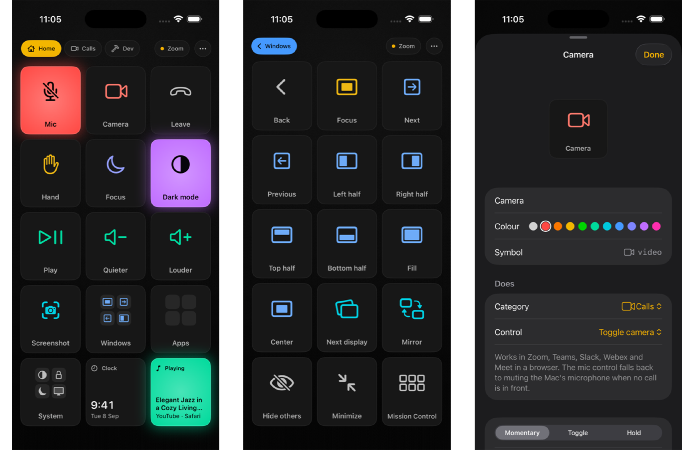
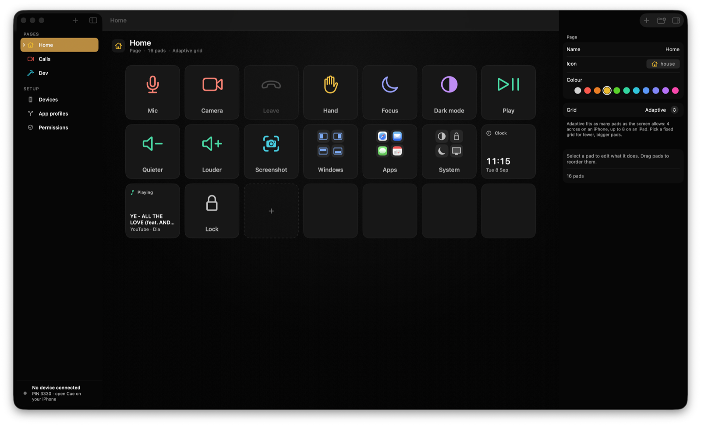
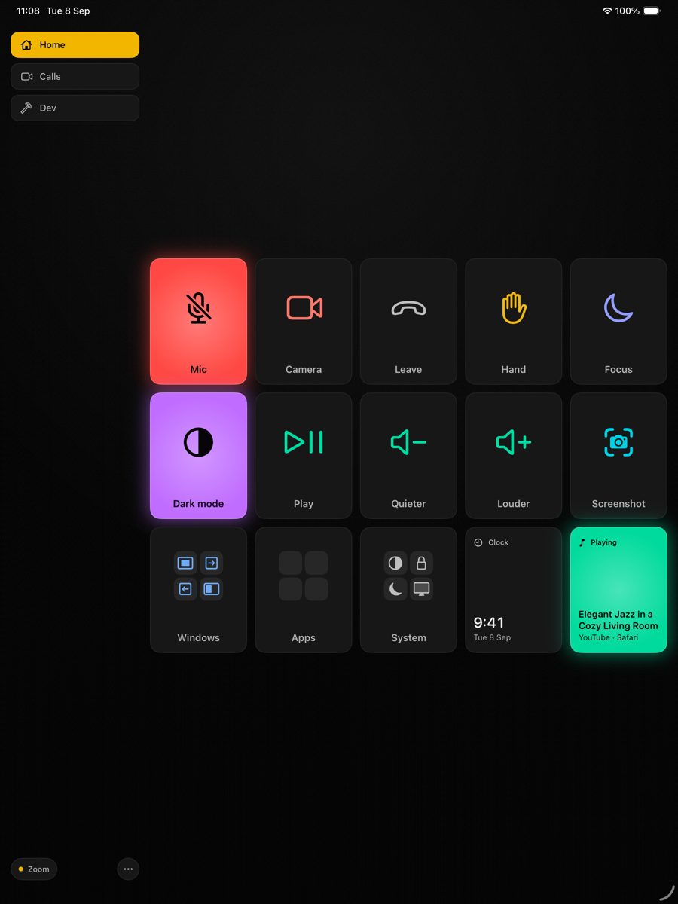

  

<h1 align="center">Cue</h1>

  Your iPhone or iPad as a control surface for your Mac. 
  A Stream Deck without the hardware, with a Launchpad's honesty about state.

  
  
  

  
  
  
  
  

  

## What it does

Tap a pad on your phone and it happens on the Mac. Every pad tells the truth: it lights up only when the Mac confirms the thing is on, breathes while the Mac is working, and dims when an action is not possible right now.

- **Calls.** One Mic pad that works in Zoom, Teams, Slack huddles, Webex and Google Meet, falling back to the Mac's own mute when nothing is in front. Camera, share screen, raise hand, leave. A Live Activity keeps mic state on your Lock Screen while you are in a call.
- **Windows and displays.** Halves, fill, centre, next display. **Focus** hides every other app and puts your window in the middle third of the screen; tap again and everything comes back. Step through windows across apps, each landing in the same place.
- **Inside apps.** Cue reads any app's menu bar and lists every command. It can also read what an app is showing and press a named button, link or tab, so a pad can open a specific chat or board even in web based apps like Slack or Grok Bots.
- **Run things.** Terminal pads open a real window and run what you typed (`claude --dangerously-skip-permissions` is the demo). Silent shell, Shortcuts, AppleScript, keyboard shortcuts, typed text, System Settings panes.
- **Make it yours.** Add a pad in a few taps from the phone or the Mac. Icons, colours, grids from 2×2 to 8×4, folders, multi‑state pads that cycle each tap, hold pads for push‑to‑talk, pages that switch with the app in front, undo. Edits sync instantly between devices.
- **Widget, Siri, Action button.** A configurable Home Screen widget presses pads without opening the app. Pads work from Shortcuts, Siri and Back Tap.

  

## Get started

1. **Mac:** download the DMG from the [latest release](https://github.com/heyimjames/cue-releases/releases/latest), open it and drag Cue to Applications. It is signed with a Developer ID and notarized by Apple. Cue lives in the menu bar.
2. **iPhone or iPad:** Cue is on TestFlight. [Ask for access](https://github.com/heyimjames/cue-releases/issues/new?template=testflight.yml) and you will get an invite.
3. Open Cue on both, on the same Wi‑Fi. Choose your Mac on the phone and type the four‑digit code shown under **Devices** in Cue for Mac. Once.

The starter deck covers calls, sound, windows, system and a developer page, so it is useful before you edit anything.

  

## How it works

- The two apps find each other with Bonjour and talk directly over your local network, encrypted with TLS. Pairing issues each device its own secret; nothing goes through a server.
- The Mac watches real state (CoreAudio for the microphone, the frontmost app, window layout, what is playing) and pushes it to the phone, so a lit pad is never a guess.
- Presses are confirmed: a pad flashes its ring when the Mac says done, and shows the reason in place when something could not happen.

## Requirements and permissions

macOS 26 or later, iOS or iPadOS 26 or later, both devices on the same Wi‑Fi.

The Mac app asks for permissions only when a pad needs them, and dims pads that need something you have not granted yet:

| Permission | Used for |
| --- | --- |
| Accessibility | keyboard pads, moving windows, pressing menu items and in‑app buttons |
| Automation | dark mode, Terminal pads, media apps, browser tabs (asked per app on first use) |
| Screen Recording | screenshot pads only |

## Privacy

Cue collects nothing. No accounts, no analytics, no servers. Read the [privacy policy](PRIVACY.md).

## Support

Read [SUPPORT.md](SUPPORT.md) for common fixes, or [open an issue](https://github.com/heyimjames/cue-releases/issues). Ideas and questions are welcome in [Discussions](https://github.com/heyimjames/cue-releases/discussions).

## Roadmap

USB connection for hostile Wi‑Fi, an Apple Watch mini deck, Control Center controls, per‑app decks generated from an app's menus, sliders for volume and brightness, and import from Stream Deck profiles.

---

Made in Lisbon by <a href="https://x.com/james_frewin">James Frewin</a>. If Cue is useful to you, a star helps other people find it.

